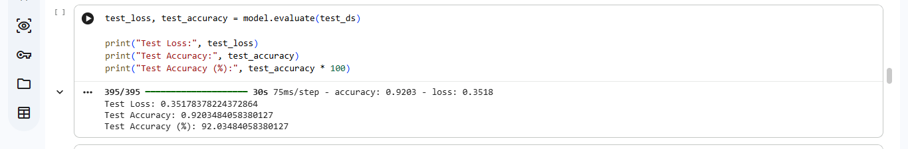
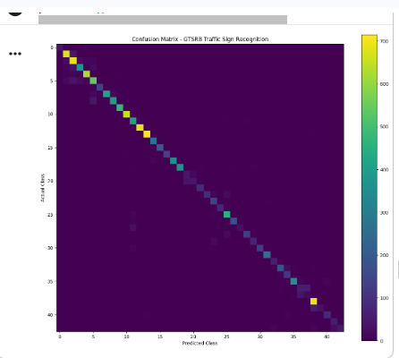
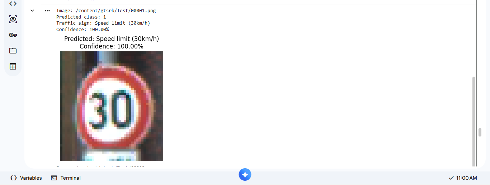

# Traffic Sign Recognition

## 🚦 Project Overview

This project focuses on recognizing and classifying traffic signs using deep learning and image classification techniques.

The project uses the **German Traffic Sign Recognition Benchmark (GTSRB)** dataset. The images are preprocessed and used to train a convolutional neural network (CNN) for traffic sign classification.

The project was developed and tested using **Google Colab** with **TensorFlow/Keras**.

---

## 🎯 Objectives

- Recognize and classify different types of traffic signs.
- Preprocess traffic sign images for model training.
- Build and train a CNN-based image classification model.
- Evaluate the model using test data.
- Predict previously unseen traffic sign images.

---

## 📊 Dataset

The project uses the **GTSRB (German Traffic Sign Recognition Benchmark)** dataset.

Dataset source:

[GTSRB - German Traffic Sign Recognition Benchmark](https://www.kaggle.com/meowmeowmeowmeowmeow/gtsrb-german-traffic-sign)

### Dataset Details

- **Training examples:** 31,367
- **Validation examples:** 7,842
- **Testing examples:** 12,630
- **Number of classes:** 43
- **Image shape:** `(32, 32, 1)`
- **Image type:** Grayscale

---

## 🔧 Data Preprocessing

The original traffic sign images have different sizes, so they were processed into a consistent format.

The preprocessing steps include:

- Resizing images to `32 × 32`
- Converting images to grayscale
- Normalizing pixel values
- Splitting the dataset into training, validation, and testing sets

---

## 🧠 Model Architecture

The project uses a Convolutional Neural Network (CNN) inspired by the LeNet-style architecture.

| Layer | Description |
|---|---|
| Input | 32 × 32 × 1 grayscale image |
| Convolution | 5 × 5 kernel, output 28 × 28 × 6 |
| ReLU | Activation function |
| Max Pooling | 2 × 2 pooling |
| Convolution | 5 × 5 kernel, output 10 × 10 × 16 |
| ReLU | Activation function |
| Max Pooling | 2 × 2 pooling |
| Fully Connected | Input = 400, Output = 120 |
| Fully Connected | Input = 120, Output = 84 |
| Dropout | Regularization |
| Fully Connected | Input = 84, Output = 43 |
| Softmax | Output layer |

The final output layer contains **43 classes**, corresponding to the traffic sign categories in the dataset.

---

## 📈 Model Evaluation

The trained model was evaluated using the test dataset containing **12,630 images**.

### Test Results

| Metric | Result |
|---|---:|
| Test Loss | 0.3518 |
| Test Accuracy | **92.03%** |
| Macro Average F1-score | 0.8624 |
| Weighted Average F1-score | 0.9194 |

The model achieved a **test accuracy of 92.03%** on the GTSRB test dataset.

---

## 📸 Results

### Model Accuracy



### Confusion Matrix



### Prediction Output



---

## 🛠️ Technologies Used

- Python
- TensorFlow
- Keras
- NumPy
- Pandas
- Matplotlib
- Scikit-learn
- Google Colab
- Jupyter Notebook

---

## 📂 Project Structure

```text
traffic-sign-recognition/
│
├── Traffic_Sign_Recognition.ipynb
├── README.md
├── requirements.txt
├── .gitignore
├── accuracy.png
├── confusion_matrix.png
└── prediction.png
